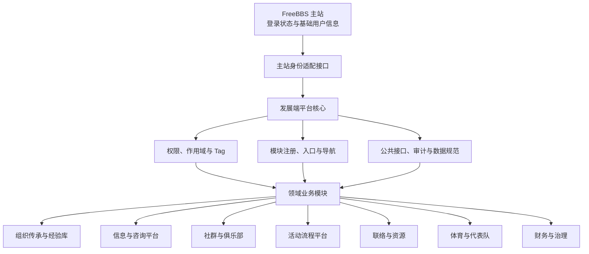

# FreeBBS 发展端总体技术设计

> 文档状态：初版总体设计
>
> 主要读者：FreeBBS 发展端开发组、各业务模块负责人
>
> 输入依据：《组织结构调整和表格维护初稿》及 2026-07-22 项目讨论

## 1. 文档目的

FreeBBS 发展端是 FreeBBS 主站的独立子页面平台，用于承载组织传承、信息公开、社群建设、活动流程和部门业务等持续扩展的能力，并与主站共享登录状态和基础用户信息。

本文档用于统一项目定位、系统边界和开发分工，使核心平台组与各业务团队能够并行开发。本文档不指定具体前端框架、后端框架、数据库、认证协议或部署平台；这些内容应在总体边界稳定后分别形成专题设计。

## 2. 总体原则

1. **一个身份体系**：发展端复用 FreeBBS 主站身份，不建立第二套账号、密码或登录体系。
2. **一套权限底座**：所有业务模块使用平台统一的角色、权限、作用域和 Tag，不自行实现互不兼容的权限系统。
3. **平台核心与领域模块分离**：核心组维护跨模块能力，领域团队维护业务实现和领域数据。
4. **以契约协作**：模块通过已声明的身份上下文、权限动作和接口访问其他能力，不直接依赖其他模块内部实现。
5. **默认最小权限**：未明确授予的访问默认拒绝；开发身份不自动获得生产数据权限。
6. **责任随模块长期存在**：每个模块必须有明确负责人、维护团队、验收标准和退出交接方式。
7. **Agent 只做辅助**：Agent 可以帮助整理、检索和更新资料，但不能替代清晰、稳定、持续维护的正式内容。

## 3. 总体结构

### 3.1 FreeBBS 主站

主站是登录状态和基础用户身份的权威来源。发展端只消费完成业务所需的最小用户信息，不保存主站密码，也不擅自修改主站用户资料。

### 3.2 发展端平台核心

平台核心提供所有模块共同依赖且不能重复建设的能力：

- 主站身份对接和统一用户上下文
- 角色、权限、作用域和可扩展 Tag
- 模块注册、入口、导航和访问控制
- 公共接口约定、跨模块调用边界
- 操作审计、安全规则和故障隔离

### 3.3 领域业务模块

领域模块独立实现具体业务。模块可以由不同团队并行开发，但必须遵守平台身份、权限和接口契约。模块之间不得直接读取对方数据库或依赖对方内部代码。

## 4. 开发责任边界

### 4.1 核心平台组

核心平台组建议由项目负责人直接牵头，负责：

- 对接 FreeBBS 主站登录和基础用户信息
- 设计并维护统一权限系统及 Tag 扩展接口
- 定义模块接入、公共接口、审计和数据边界
- 维护平台外壳、统一入口和模块注册机制
- 审核模块是否满足安全、权限和长期维护要求

### 4.2 领域业务团队

各部门或专题开发组负责：

- 梳理本领域需求、流程和术语
- 开发领域页面、业务逻辑和接口
- 维护本领域数据、测试和使用文档
- 指定长期负责人并处理本模块故障和数据问题
- 配合核心组完成权限声明和接入验收

例如，体育团队可以独立开发代表队系统；平台核心负责识别体育负责人和代表队队长、限制数据作用域并记录敏感操作。

### 4.3 共同责任

核心组与领域团队共同确认：

- 模块负责人和维护团队
- 模块使用的身份字段和权限动作
- 数据可见、可编辑和可导出的范围
- 对外提供或消费的接口
- 验收条件、故障责任和交接方式

## 5. 功能域与建议分工

| 能力包           | 主要范围                                                                               | 建议责任方                             |
| ---------------- | -------------------------------------------------------------------------------------- | -------------------------------------- |
| 平台核心         | 主站身份对接、权限与 Tag、模块注册、公共接口、审计                                     | 项目负责人或核心平台组                 |
| 组织传承与经验库 | 工作流程、常见问题、联系人、活动复盘、注意事项、组织架构、培养资料、工作周程、成果收集 | 核心组定义结构，各部门建设并维护内容   |
| 信息与咨询平台   | 信息公开、咨询入口、资源展示、意见反馈和处理状态                                       | 权益发展团队牵头，信息所属部门共同维护 |
| 社群与俱乐部     | 社群和俱乐部的建立、目录、维护责任、成员协作与活动关联                                 | 独立专题开发组或认领团队               |
| 活动流程平台     | “我要办活动”、班团活动收集、活动报名、流程规范、状态流转和标准接口                     | 核心组定义通用流程，各部门开发领域扩展 |
| 联络与资源       | 校友、校系级、企业资源联系清单，学生组织通讯录，开放班团资源                           | 联络团队牵头                           |
| 体育与代表队     | 代表队信息、队长身份、队长打卡和后续代表队业务                                         | 体育团队牵头                           |
| 财务与治理       | 团委预决算记录、汇总统计及其与活动的关联                                               | 团委相关同学牵头，核心组协助接入       |

领域团队拥有业务实现和长期维护责任，但不会因此自动获得该领域的全部数据权限。

## 6. 初始功能清单

下表保留初稿中的现状和访问边界，用作任务认领和后续专题设计的输入。

| 初始功能                       | 当前状态                 | 初始访问边界                           | 所属能力包       |
| ------------------------------ | ------------------------ | -------------------------------------- | ---------------- |
| 各组织及年级组工作周程安排     | 已有底稿，需专题研讨确认 | 学生组织可访问；个人按年级组作用域访问 | 组织传承与经验库 |
| 各组织工作成果收集             | 当前不存在，需建立       | 学生组织访问                           | 组织传承与经验库 |
| 各组织开放班团资源             | 已有雏形，待维护         | 学生组织和班团访问                     | 联络与资源       |
| 团委预决算统计                 | 已有雏形，待确认工作流   | 学生组织访问本组织；代表队访问本代表队 | 财务与治理       |
| 校友、校系级和企业资源联系清单 | 当前不存在，需建立       | 学生组织访问                           | 联络与资源       |
| 电子系社工组织架构和工作整理   | 当前不存在，需收集建立   | 全体访问                               | 组织传承与经验库 |
| 学生组织通讯录                 | 每年已有资料，可接入     | 学生组织访问                           | 联络与资源       |
| 社工培养模块                   | 已有部分文档，需修改     | 学生组织访问                           | 组织传承与经验库 |
| 班团活动收集                   | 已存在，可接入           | 组织组管理；班团访问本班数据           | 活动流程平台     |
| “我要办活动”指南               | 当前不存在，需总结       | 班团访问                               | 活动流程平台     |
| 意见反馈                       | 可以集成                 | 权益发展团队管理；个人提交             | 信息与咨询平台   |
| 活动报名                       | 已存在，可扩展到其他组织 | 对应业务组管理；个人提交               | 活动流程平台     |
| 代表队队长打卡                 | 已存在，可以集成         | 体育团队管理；队长访问本代表队         | 体育与代表队     |

社群与俱乐部是新增能力包，应在平台核心接入规范稳定后，由认领团队进一步定义首批业务范围。

## 7. 主站身份共享边界

### 7.1 身份来源

- FreeBBS 主站负责认证用户并维护基础用户身份。
- 发展端通过身份适配接口获得统一用户上下文。
- 业务模块只接收完成授权判断和页面展示所需的字段，不直接接触主站会话凭据。
- 主站身份失效、退出或被禁用后，发展端的受保护访问必须同步失效。

### 7.2 统一用户上下文

平台向模块提供稳定的用户上下文，概念上至少包含：

- 不随展示信息变化的用户标识
- 展示所需的基础用户信息
- 当前有效的角色、Tag 和作用域
- 身份及权限的有效期或版本

具体字段名、传输协议和缓存策略由主站接入专题设计确定。业务模块不得依赖未进入正式契约的主站内部字段。

## 8. 权限系统总体设计

权限系统采用“角色 + 动作 + 资源 + 作用域 + Tag”的组合模型。组织职务决定默认管理范围，具体权限由明确动作表达，特殊身份通过并列 Tag 叠加，避免把所有组合固化成大量角色。

### 8.1 基础角色层级

| 层级或身份         | 初始范围               | 权限定位                                                       |
| ------------------ | ---------------------- | -------------------------------------------------------------- |
| 最高权限           | 全平台                 | 管理平台、角色、权限、模块和全局安全策略；所有敏感操作仍需审计 |
| 文艺负责人         | 文艺领域               | 管理文艺领域的模块、部门和授权范围                             |
| 体育负责人         | 体育领域               | 管理体育领域的模块、部门和授权范围                             |
| 联络负责人         | 联络领域               | 管理联络领域的模块、部门和授权范围                             |
| 权益发展负责人     | 权益发展领域           | 管理权益发展领域的模块、部门和授权范围                         |
| 文艺部长或主任     | 指定文艺部门或单元     | 管理本部门业务和成员                                           |
| 体育部长或主任     | 指定体育部门或单元     | 管理本部门业务和成员                                           |
| 联络部长或主任     | 指定联络部门或单元     | 管理本部门业务和成员                                           |
| 权益发展部长或主任 | 指定权益发展部门或单元 | 管理本部门业务和成员                                           |
| 文艺部员           | 指定文艺部门或任务     | 使用获授的业务功能                                             |
| 体育部员           | 指定体育部门或任务     | 使用获授的业务功能                                             |
| 联络部员           | 指定联络部门或任务     | 使用获授的业务功能                                             |
| 权益发展部员       | 指定权益发展部门或任务 | 使用获授的业务功能                                             |
| 团委同学           | 被授权的团委业务       | 使用团委相关模块；不自动获得其他领域管理权限                   |
| 科协同学           | 被授权的科协业务       | 使用科协相关模块；不自动获得其他领域管理权限                   |
| 普通同学           | 公开资源及个人作用域   | 浏览公开信息，提交与维护本人有权处理的数据                     |

用户可以同时拥有多个角色。角色层级表示默认管理覆盖范围，不代表模块可以省略具体动作检查。

### 8.2 并列权限：体育代表队队长

体育代表队队长不是普通层级中的上下级角色，而是可以与任何基础角色并存的作用域 Tag：

- Tag 必须绑定具体代表队，不能默认访问全部代表队。
- 队长可以获得本代表队的打卡、成员或业务数据权限。
- 体育负责人可以拥有跨代表队的管理权限，但队长权限不会自动向其他代表队扩散。
- 同一用户可以同时是普通同学、部门成员和某支代表队队长。

班团、年级组、活动负责人等未来身份也应优先采用相同的“Tag + 作用域”方式扩展。

### 8.3 权限 Tag 扩展接口

平台预留统一 Tag 注册与授予接口。每个 Tag 至少声明：

- 全局唯一且带命名空间的 Tag 标识
- 中文展示名称和业务含义
- 签发或维护责任方
- 适用资源类型和作用域标识
- 生效时间、失效时间和当前状态
- 可审计的授予来源
- 业务扩展属性

领域模块可以申请注册新 Tag，但不能绕过平台直接创建不可审计的权限身份。Tag 本身不等于无限权限，仍需由权限策略把 Tag 映射到允许的动作和资源。

### 8.4 权限判断流程

1. 平台从主站确认用户身份并生成统一用户上下文。
2. 平台加载当前有效的角色、Tag 和作用域。
3. 业务模块声明本次操作对应的资源与动作。
4. 权限系统计算允许或拒绝；未匹配到允许规则时默认拒绝。
5. 敏感读取、修改、授权和批量操作写入审计记录。

权限数据异常或权限服务不可用时，受保护操作必须采用关闭式失败，即拒绝访问而不是放行。

## 9. 模块接入契约

每个领域模块接入平台前必须提交模块声明，至少包括：

- 模块标识、名称、简介和入口
- 负责人、维护团队和联系渠道
- 当前状态及预期使用人群
- 所需的身份字段、权限动作和作用域
- 提供和消费的接口
- 数据归属、敏感级别和保留规则
- 故障时的降级行为和维护责任
- 测试方式和验收标准

平台根据模块声明生成统一入口和访问检查。模块不得自行复制主站用户库、保存主站密码或绕过平台权限接口。

## 10. 数据与接口边界

- 平台核心拥有身份映射、权限配置、模块注册和平台审计数据。
- 领域模块拥有本领域业务数据，并对正确性、导入、导出和维护负责。
- 跨模块访问必须经过版本化接口，不直接读取其他模块存储。
- 对外公开、组织内共享、限定团队和个人私有数据必须明确区分。
- 联系人、意见反馈、成员身份等敏感数据遵循最小展示和最小导出原则。
- 已有表格或系统接入时，先明确权威数据源，避免平台与原系统同时可写造成冲突。
- 接口修改必须保持兼容或提供清晰迁移路径，不将领域内部结构暴露为公共契约。

## 11. Agent 辅助经验库

Agent 可以用于：

- 对历史资料分类、摘要和生成检索关键词
- 根据已有模板辅助整理流程、常见问题和活动复盘
- 检测可能过期、重复或缺少负责人的内容
- 帮助有权限的维护者检索和提出更新草稿

Agent 必须遵守以下边界：

- 只能访问当前用户本来有权访问的资料。
- 输出默认视为草稿，并保留来源线索。
- 正式流程、联系人和重要结论发布前必须由责任人确认。
- 不得自动授予权限、绕过审核或不可逆删除正式资料。
- Agent 发起的写入必须可追踪、可审计，并尽量支持回退。

经验库的质量最终由清晰写作、稳定存放和持续维护保证，Agent 不是内容责任人。

## 12. 可靠性、安全与审计

- 主站身份不可确认时，不允许受保护操作；公开只读内容可按既定策略独立展示。
- 单个领域模块故障不得影响平台核心和其他模块使用。
- 跨模块写入应避免重复执行，并在失败时给出可恢复状态。
- 权限变更、敏感数据访问、批量导出和管理操作必须审计。
- 角色或 Tag 到期、撤销后，应在可接受的短时间内失效。
- 模块应向用户明确展示无权限、数据不存在、依赖不可用和操作冲突等不同状态。
- 任何模块下线前都必须确认数据归档、导出和入口移除方案。

## 13. 测试与接入验收

### 13.1 平台核心验收

- 主站登录、退出、过期和禁用状态能够正确传递。
- 权限矩阵覆盖最高权限、四类负责人、部长或主任、部员、团委、科协和普通同学。
- 多角色用户以及“代表队队长 + 其他角色”的组合得到正确结果。
- 跨部门、跨代表队和跨个人作用域的访问被正确拒绝。
- 模块注册、权限声明和审计记录可以独立验证。

### 13.2 领域模块验收

- 模块不登录时、无权限时和权限过期时均有明确行为。
- 模块只使用正式用户上下文和权限接口。
- 数据读写范围与模块声明一致。
- 关键流程有自动化测试或可重复的验收步骤。
- 使用说明、维护责任和故障处理方式随模块一同交付。

### 13.3 接口验收

- 主站身份接口和模块接入接口具备契约测试。
- 接口失败不会导致越权、重复写入或静默丢失数据。
- 接口版本变化具有兼容或迁移验证。

## 14. 开发组分工方式

每个可认领任务以“能力包或模块”为单位，而不是只认领一个页面。任务介绍至少说明：

1. 业务目标和目标用户
2. 负责人与长期维护团队
3. 依赖的平台核心能力
4. 输入、输出和数据归属
5. 权限动作与作用域
6. 阶段性交付物和验收方式

建议优先顺序：

1. 核心组先稳定主站身份边界、权限模型、Tag 接口和模块声明格式。
2. 优先接入已有或已有雏形的功能，验证平台接入契约。
3. 各团队并行建设经验库、信息咨询、活动流程、联络资源等新能力。
4. 在身份、权限和模块接入稳定后扩展社群、俱乐部以及 Agent 辅助能力。

该顺序只描述依赖关系，不规定具体开发周期。

## 15. 后续专题文档

总体设计确认后，各负责人可分别形成以下专题文档：

- 主站身份与用户信息接入设计
- 权限、作用域与 Tag 接口定义
- 模块声明和接入规范
- 活动流程状态与接口设计
- 经验库内容模型和维护规范
- 各领域模块的独立需求与技术设计
- 部署、监控和数据备份方案

专题文档不得改变本文确定的统一身份、统一权限、平台核心与领域模块分离原则；如确需调整，应先更新总体设计并完成开发组评审。
